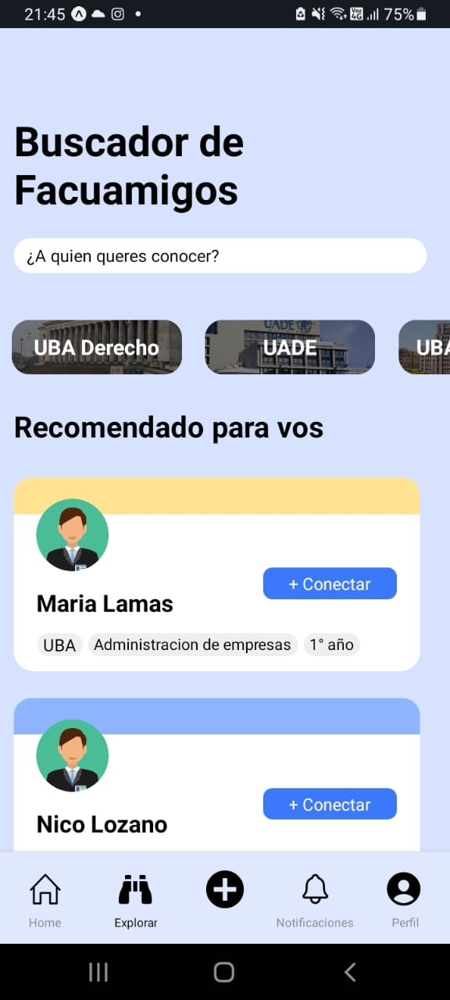

# BlueRabbit
Bluerabbit React Native challenge

  

## Descripcion:
Challenge de React Native, la aplicacion muestra solo una pantalla de una red social, esta misma pantalla tiene un header, un input para buscar amigos y ademas muestra un listado de universidades. De bajo tenemos una lista de 20 usuarios, la aplicacion solo muestra de a 10 usuarios, ademas si hacemos click en la opcion "+ Conectar" de cada usuario, este se eliminara de la lista. Tambien cuenta con un TabBar para poder navegar entre las distintas pantallas.

## Para correr aplicacion seguir las siguientes instrucciones
# 1- Ingresar en la carpeta "client" y ejecutar en la terminal comando "npm install" en la raiz del directorio
# 2- Posicionado en la carpeta "client" ejecutar comando "npm start" en la terminal
# 3- Escanear QR en la terminal con el celular con la app Expo
# 4- Disfrutar la aplicacion 😁
